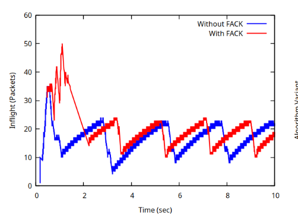
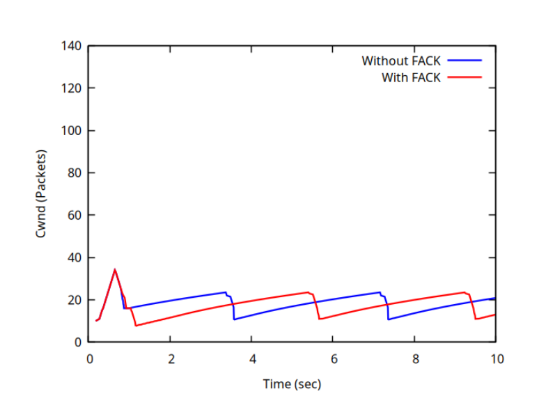

.. include:: replace.txt
.. highlight:: cpp

TCP Models in ns-3
==================

This chapter describes the TCP models available in |ns3|.

This figure shows the organization of TCP components in ns-3, including
congestion control, loss detection, and loss recovery along with their
associated mechanisms and algorithms.

**Structure of TCP model documentation in ns-3**

.. _fig-tcp-documentation-restructuring:

.. figure:: figures/tcp-documentation-restructuring.*
   :align: center

   Structure of TCP model documentation in ns-3

Scope and Limitations
---------------------

- TcpCongestionOps interface does not contain every possible Linux operation.

Model History and Acknowledgments
---------------------------------

ns-3 TCP
~~~~~~~~

In brief, the native |ns3| TCP model supports a full bidirectional TCP with
connection setup and close logic. Several congestion control algorithms
are supported, with CUBIC the default, and NewReno, Westwood, Hybla, HighSpeed,
Vegas, Scalable, Veno, Binary Increase Congestion Control (BIC), Yet Another
HighSpeed TCP (YeAH), Illinois, H-TCP, Low Extra Delay Background Transport
(LEDBAT), TCP Low Priority (TCP-LP), Data Center TCP (DCTCP) and Bottleneck
Bandwidth and RTT (BBR) also supported. The model also supports Selective
Acknowledgements (SACK), Forward Acknowledgement (FACK), Proportional Rate Reduction (PRR) and Explicit
Congestion Notification (ECN). Multipath-TCP is not yet supported in the |ns3|
releases.

Model History
~~~~~~~~~~~~~

Until the ns-3.10 release, |ns3| contained a port of the TCP model from `GTNetS
<https://web.archive.org/web/20210928123443/http://griley.ece.gatech.edu/MANIACS/GTNetS/index.html>`_,
developed initially by George Riley and ported to |ns3| by Raj Bhattacharjea.
This implementation was substantially rewritten by Adriam Tam for ns-3.10.
In 2015, the TCP module was redesigned in order to create a better
environment for creating and carrying out automated tests. One of the main
changes involves congestion control algorithms, and how they are implemented.

Before the ns-3.25 release, a congestion control was considered as a stand-alone TCP
through an inheritance relation: each congestion control (e.g. TcpNewReno) was
a subclass of TcpSocketBase, reimplementing some inherited methods. The
architecture was redone to avoid this inheritance,
by making each congestion control a separate class, and defining an interface
to exchange important data between TcpSocketBase and the congestion modules.
The Linux ``tcp_congestion_ops`` interface was used as the design reference.

Along with congestion control, Fast Retransmit and Fast Recovery algorithms
have been modified; in previous releases, these algorithms were delegated to
TcpSocketBase subclasses. Starting from ns-3.25, they have been merged inside
TcpSocketBase. In future releases, they can be extracted as separate modules,
following the congestion control design.

As of the ns-3.31 release, the default initial window was set to 10 segments
(in previous releases, it was set to 1 segment).  This aligns with current
Linux default, and is discussed further in :rfc:`6928`.

In the ns-3.32 release, the default recovery algorithm was set to
Proportional Rate Reduction (PRR) from the classic ack-clocked Fast
Recovery algorithm.

In the ns-3.34 release, the default congestion control algorithm was set
to CUBIC from NewReno.

CUBIC was extended to support Reno-friendliness (see RFC 9438 Section 4.3) in
the ns-3.41 release.  This feature is called 'TCP friendliness' in earlier
versions of the CUBIC RFCs, and in the Linux and ns-3 implementations.

Acknowledgments
~~~~~~~~~~~~~~~

As mentioned above, |ns3| TCP has had multiple authors and maintainers over
the years. Several publications exist on aspects of |ns3| TCP, and users
of |ns3| TCP are requested to cite one of the applicable papers when
publishing new work.

A general reference on the current architecture is found in [:ref:`1<tcpRef1>`].

For an academic peer-reviewed paper on the SACK implementation in ns-3,
please refer to [:ref:`2<tcpRef2>`].

Overview of Implementation
--------------------------

|ns3| was written to support multiple TCP implementations. The implementations
inherit from a few common header classes in the ``src/network`` directory, so that
user code can swap out implementations with minimal changes to the scripts.

There are three important abstract base classes:

* class :cpp:class:`TcpSocket`: This is defined in
  ``src/internet/model/tcp-socket.{cc,h}``. This class exists for hosting TcpSocket
  attributes that can be reused across different implementations. For instance,
  the attribute ``InitialCwnd`` can be used for any of the implementations
  that derive from class :cpp:class:`TcpSocket`.
* class :cpp:class:`TcpSocketFactory`: This is used by the layer-4 protocol
  instance to create TCP sockets of the right type.
* class :cpp:class:`TcpCongestionOps`: This supports different variants of
  congestion control-- a key topic of simulation-based TCP research.

There are presently two active implementations of TCP available for |ns3|.

* a natively implemented TCP for ns-3
* support for kernel implementations via `Direct Code Execution (DCE) <https://www.nsnam.org/overview/projects/direct-code-execution/>`__

Direct Code Execution is limited in its support for newer kernels; at
present, only Linux kernel 4.4 is supported.  However, the TCP implementations
in kernel 4.4 can still be used for ns-3 validation or for specialized
simulation use cases.

It should also be mentioned that various ways of combining virtual machines
with |ns3| makes available also some additional TCP implementations, but
those are out of scope for this chapter.

Architecture
------------

TCP Socket Interaction and Interface with Application Layer
~~~~~~~~~~~~~~~~~~~~~~~~~~~~~~~~~~~~~~~~~~~~~~~~~~~~~~~~~~~

In the following there is an analysis on the public interface of the TCP socket,
and how it can be used to interact with the socket itself. An analysis of the
callback fired by the socket is also carried out. Please note that, for
the sake of clarity, we will use the terminology "Sender" and "Receiver" to clearly
divide the functionality of the socket. However, in TCP these two roles can be
applied at the same time (i.e. a socket could be a sender and a receiver at the
same time): our distinction does not lose generality, since the following
definition can be applied to both sockets in case of full-duplex mode.

**TCP state machine (for commodity use)**

.. _fig-tcp-state-machine:

.. figure:: figures/tcp-state-machine.*
   :align: center

   TCP State machine

In ns-3 we are fully compliant with the state machine depicted in
Figure :ref:`fig-tcp-state-machine`.

**Public interface for receivers (e.g. servers receiving data)**

*Bind()*
  Bind the socket to an address, or to a general endpoint. A general endpoint
  is an endpoint with an ephemeral port allocation (that is, a random port
  allocation) on the 0.0.0.0 IP address. For instance, in current applications,
  data senders usually binds automatically after a *Connect()* over a random
  port. Consequently, the connection will start from this random port towards
  the well-defined port of the receiver. The IP 0.0.0.0 is then translated by
  lower layers into the real IP of the device.

*Bind6()*
  Same as *Bind()*, but for IPv6.

*BindToNetDevice()*
  Bind the socket to the specified NetDevice, creating a general endpoint.

*Listen()*
  Listen on the endpoint for an incoming connection. Please note that this
  function can be called only in the TCP CLOSED state, and transit in the
  LISTEN state. When an incoming request for connection is detected (i.e. the
  other peer invoked *Connect()*) the application will be signaled with the
  callback *NotifyConnectionRequest* (set in *SetAcceptCallback()* beforehand).
  If the connection is accepted (the default behavior, when the associated
  callback is a null one) the Socket will fork itself, i.e. a new socket is
  created to handle the incoming data/connection, in the state SYN_RCVD. Please
  note that this newly created socket is not connected anymore to the callbacks
  on the "father" socket (e.g. DataSent, Recv); the pointer of the newly
  created socket is provided in the Callback *NotifyNewConnectionCreated* (set
  beforehand in *SetAcceptCallback*), and should be used to connect new
  callbacks to interesting events (e.g. Recv callback). After receiving the ACK
  of the SYN-ACK, the socket will set the congestion control, move into
  ESTABLISHED state, and then notify the application with
  *NotifyNewConnectionCreated*.

*ShutdownSend()*
  Signal a termination of send, or in other words prevents data from being added
  to the buffer. After this call, if buffer is already empty, the socket
  will send a FIN, otherwise FIN will go when buffer empties. Please note
  that this is useful only for modeling "Sink" applications. If you have
  data to transmit, please refer to the *Send()* / *Close()* combination of
  API.

*GetRxAvailable()*
  Get the amount of data that could be returned by the Socket in one or multiple
  call to Recv or RecvFrom. Please use the Attribute system to configure the
  maximum available space on the receiver buffer (property "RcvBufSize").

*Recv()*
  Grab data from the TCP socket. Please remember that TCP is a stream socket,
  and it is allowed to concatenate multiple packets into bigger ones. If no data
  is present (i.e. *GetRxAvailable* returns 0) an empty packet is returned.
  Set the callback *RecvCallback* through *SetRecvCallback()* in order to have
  the application automatically notified when some data is ready to be read.
  It's important to connect that callback to the newly created socket in case
  of forks.

*RecvFrom()*
  Same as Recv, but with the source address as parameter.

**Public interface for senders (e.g. clients uploading data)**

*Connect()*
  Set the remote endpoint, and try to connect to it. The local endpoint should
  be set before this call, or otherwise an ephemeral one will be created. The
  TCP then will be in the SYN_SENT state. If a SYN-ACK is received, the TCP will
  setup the congestion control, and then call the callback
  *ConnectionSucceeded*.

*GetTxAvailable()*
  Return the amount of data that can be stored in the TCP Tx buffer. Set this
  property through the Attribute system ("SndBufSize").

*Send()*
  Send the data into the TCP Tx buffer. From there, the TCP rules will decide
  if, and when, this data will be transmitted. Please note that, if the tx
  buffer has enough data to fill the congestion (or the receiver) window, dynamically
  varying the rate at which data is injected in the TCP buffer does not have any
  noticeable effect on the amount of data transmitted on the wire, that will
  continue to be decided by the TCP rules.

*SendTo()*
  Same as *Send()*.

*Close()*
  Terminate the local side of the connection, by sending a FIN (after all data
  in the tx buffer has been transmitted). This does not prevent the socket in
  receiving data, and employing retransmit mechanism if losses are detected. If
  the application calls *Close()* with unread data in its rx buffer, the socket
  will send a reset. If the socket is in the state SYN_SENT, CLOSING, LISTEN,
  FIN_WAIT_2, or LAST_ACK, after that call the application will be notified with
  *NotifyNormalClose()*. In other cases, the notification is delayed
  (see *NotifyNormalClose()*).

**Public callbacks**

These callbacks are called by the TCP socket to notify the application of
interesting events. We will refer to these with the protected name used in
socket.h, but we will provide the API function to set the pointers to these
callback as well.

*NotifyConnectionSucceeded*: *SetConnectCallback*, 1st argument
  Called in the SYN_SENT state, before moving to ESTABLISHED. In other words, we
  have sent the SYN, and we received the SYN-ACK: the socket prepares the
  sequence numbers, sends the ACK for the SYN-ACK, tries to send out more data (in
  another segment) and then invokes this callback. After this callback, it
  invokes the NotifySend callback.

*NotifyConnectionFailed*: *SetConnectCallback*, 2nd argument
  Called after the SYN retransmission count goes to 0. SYN packet is lost
  multiple times, and the socket gives up.

*NotifyNormalClose*: *SetCloseCallbacks*, 1st argument
  A normal close is invoked. A rare case is when we receive an RST segment (or a
  segment with bad flags) in normal states. All other cases are:
  - The application tries to *Connect()* over an already connected socket
  - Received an ACK for the FIN sent, with or without the FIN bit set (we are in LAST_ACK)
  - The socket reaches the maximum amount of retries in retransmitting the SYN (*)
  - We receive a timeout in the LAST_ACK state
  - Upon entering the TIME_WAIT state, before waiting the 2*Maximum Segment Lifetime seconds to finally deallocate the socket.

*NotifyErrorClose*: *SetCloseCallbacks*, 2nd argument
  Invoked when we send an RST segment (for whatever reason) or we reached the
  maximum amount of data retries.

*NotifyConnectionRequest*: *SetAcceptCallback*, 1st argument
  Invoked in the LISTEN state, when we receive a SYN. The return value indicates
  if the socket should accept the connection (return true) or should ignore it
  (return false).

*NotifyNewConnectionCreated*: *SetAcceptCallback*, 2nd argument
  Invoked when from SYN_RCVD the socket passes to ESTABLISHED, and after setting
  up the congestion control, the sequence numbers, and processing the incoming
  ACK. If there is some space in the buffer, *NotifySend* is called shortly
  after this callback. The Socket pointer, passed with this callback, is the
  newly created socket, after a Fork().

*NotifyDataSent*: *SetDataSentCallback*
  The Socket notifies the application that some bytes have been transmitted on
  the IP level. These bytes could still be lost in the node (traffic control
  layer) or in the network.

*NotifySend*: *SetSendCallback*
  Invoked if there is some space in the tx buffer when entering the ESTABLISHED
  state (e.g. after the ACK for SYN-ACK is received), after the connection
  succeeds (e.g. after the SYN-ACK is received) and after each new ACK (i.e.
  that advances SND.UNA).

*NotifyDataRecv*: *SetRecvCallback*
  Called when in the receiver buffer there are in-order bytes, and when in
  FIN_WAIT_1 or FIN_WAIT_2 the socket receive a in-sequence FIN (that can carry
  data).

.. include:: tcp-congestion-control.rst

Loss Detection
--------------

The following loss detection mechanisms are supported in ns-3 TCP. Packet loss is
primarily detected using duplicate acknowledgments (DupAck-based detection) and
retransmission timeout (RTO). These mechanisms are responsible for identifying
packet loss events and triggering the appropriate loss recovery algorithms.

RTO
~~~

TCP employs a retransmission timer to ensure reliable data delivery in scenarios
where acknowledgments are not received from the remote peer. The duration of this
timer is referred to as the Retransmission Timeout (RTO). The computation of RTO
follows the algorithm specified in RFC 6298.

To estimate the RTO, the TCP sender maintains the following state variables:

* SRTT: Smoothed Round-Trip Time
* RTTVAR: Round-Trip Time variation

The RTO is derived as a function of measured Round-Trip Time (RTT) samples.

Upon obtaining the first RTT measurement R, the sender initializes the variables as follows:

.. math::

   \begin{aligned}
   SRTT &= R \\
   RTTVAR &= \frac{R}{2} \\
   RTO &= SRTT + \max(G, K \cdot RTTVAR)
   \end{aligned}

where G is the clock granularity and K is a constant factor (commonly set to 4).

For each subsequent RTT measurement R, the sender updates the state variables as follows:

.. math::

   \begin{aligned}
   RTTVAR &= (1 - \beta)\,RTTVAR + \beta\,|SRTT - R| \\
   SRTT &= (1 - \alpha)\,SRTT + \alpha\,R \\
   RTO &= SRTT + \max(G, K \cdot RTTVAR)
   \end{aligned}

where alpha and beta are smoothing factors, typically set to 1/8 and 1/4 respectively.

After computation, the RTO value is constrained as follows:

* If RTO < 1 second, it MUST be rounded up to 1 second.
* A maximum bound MAY be enforced, provided it is at least 60 seconds.

Upon expiration of the retransmission timer, the sender applies Binary Exponential Backoff,
as specified in RFC 6298:

.. math::

   RTO = RTO * 2

This doubling continues for consecutive retransmission timeouts, allowing TCP to adapt to
persistent network congestion or packet loss.

The RTO estimation and management in ns-3 is implemented within the TCP socket layer.

* The core functionality resides in the class :cpp:class:`TcpSocketBase` (located in ``src/internet/model/tcp-socket-base.{cc,h}``).
* The state variables required for RTO computation are maintained in: :cpp:class:`TcpSocketState` (``src/internet/model/tcp-socket-state.h``), including: :cpp:member:`TcpSocketState::m_srtt`, :cpp:member:`TcpSocketState::m_rttvar`, and :cpp:member:`TcpSocketState::m_rto`.

Fast Retransmit
~~~~~~~~~~~~~~~

TCP employs the Fast Retransmit algorithm to detect and recover from packet loss
without waiting for the RTO to expire. This mechanism relies on the reception of
duplicate acknowledgments (DupAck) from the receiver. TCP receiver sends an immediate
duplicate ACK when an out-of-order segment arrives to inform the sender that a
segment was received out-of-order and which sequence number is expected. The sender
infers segment loss based on the arrival of three consecutive duplicate ACKs, without
any intervening ACK that advances sender’s unacknowledged sequence number (SND.UNA) according to RFC 5681.

The Fast Retransmit mechanism is implemented within the TCP socket layer in ns-3.

* The core logic resides in the class :cpp:class:`TcpSocketBase` (located in ``src/internet/model/tcp-socket-base.{cc,h}``).
* Detection of duplicate ACKs and triggering of fast retransmit is handled as part of ACK processing in: :cpp:func:`TcpSocketBase::ProcessAck`.
* The actual retransmission of the lost segment is performed using: :cpp:func:`TcpSocketBase::DoRetransmit`.
* The tracking of duplicate ACK count is maintained using internal state variables such as: :cpp:member:`TcpSocketBase::m_dupAckCount`.

TCP SACK and non-SACK
~~~~~~~~~~~~~~~~~~~~~

To avoid code duplication and the effort of maintaining two different versions
of the TCP core, namely RFC 6675 (TCP-SACK) and RFC 5681 (TCP congestion control),
we have merged RFC 6675 in the current code base. If the receiver supports the
option, the sender bases its retransmissions over the received SACK information.
However, in the absence of that option, the best it can do is to follow the RFC
5681 specification (on Fast Retransmit/Recovery) and employing NewReno
modifications in case of partial ACKs.

A similar concept is used in Linux with the function tcp_add_reno_sack.
Our implementation resides in the TcpTxBuffer class that implements a scoreboard
through two different lists of segments. TcpSocketBase actively uses the API
provided by TcpTxBuffer to query the scoreboard; please refer to the Doxygen
documentation (and to in-code comments) if you want to learn more about this
implementation.

For an academic peer-reviewed paper on the SACK implementation in ns-3,
please refer to [:ref:`2<tcpRef2>`].

Forward Acknowledgement (FACK)
~~~~~~~~~~~~~~~~~~~~~~~~~~~~~~

FACK is designed to be used with the TCP SACK option.
It keeps count of the total number of bytes of outstanding data in the network. It
achieves this by using the additional information provided by TCP SACK.

FACK maintains two state variables: sndFack and retranData.

sndFack is updated to reflect the highest sequence number that has been selectively acknowledged.
In non-recovery state, the sndFack variable is updated from the acknowledgment
number in the TCP header whereas during the recovery state, the sender utilizes
information contained in TCP SACK options to update sndFack.

retranData is the amount of outstanding retransmitted data in the
network. Each time a segment is retransmitted, retranData is increased by the
segment's size; when a retransmitted segment is determined to have left the
network, retranData is decreased by the segment's size.

awnd variable is defined to be the data sender’s estimate of the actual quantity
of data outstanding in the network.

Assuming that all the unacknowledged data has left the network:

.. math::

   awnd = sndNxt - sndFack

sndNxt holds the sequence number of the first byte of unsent data.

In recovery state, data which is retransmitted must also be included in the
calculation of awnd.

.. math::

   awnd = sndNxt - sndFack + retranData

Using this measure of outstanding data, the FACK algorithm can regulate the
amount of data outstanding in the network to be within one MSS of the current
value of cwnd.

In the FACK version, the cwnd adjustment and retransmission are also triggered
when the receiver reports that the reassembly queue is longer than 3 segments:

.. code-block:: c++

   if ((m_fackEnabled && fackDiff > m_tcb->m_segmentSize * 3) ||
            ((m_dupAckCount == m_retxThresh) &&
             (m_highRxAckMark >= m_recover || (!m_recoverActive))))
        {
            EnterRecovery(currentDelivered);
            NS_ASSERT(m_tcb->m_congState == TcpSocketState::CA_RECOVERY);
        }

By default the FACK option is disabled. To enable FACK, the following
configuration can be used:

::

  Config::SetDefault ("ns3::TcpSocketBase::Fack", BooleanValue (true));

Note that FACK requires SACK to be enabled as well:

::

  Config::SetDefault ("ns3::TcpSocketBase::Sack", BooleanValue (true));

The following unit tests have been written to verify the implementation of FACK:

* This unit test creates a short packet flow and forces four consecutive lost
  segments, and verifies that the snd.fack variable is updated to the highest sequence
  number present in the incoming SACK blocks, and that its external calculation of
  awnd matches the internal state variable.

  The test monitors the sender's ACK processing and performs two key checks:

  1. snd.fack: It parses incoming SACK blocks to determine the highest
     acknowledged sequence number and verifies that the implementation updates
     `snd.fack` correctly.

  2. awnd: It recomputes the in-flight data window using the FACK formula
     (`awnd = snd.nxt - snd.fack + retransmitted_data`) and confirms that this
     matches the implementation's internal value.

A successful test run ensures that the TCP FACK implementation accurately tracks
the forward acknowledgment point and the amount of data in flight during
recovery.

Example and Performance Verification
^^^^^^^^^^^^^^^^^^^^^^^^^^^^^^^^^^^^

The example ``examples/tcp/fack-example.cc`` can be used to observe the
FACK algorithm's influence on congestion control, specifically regarding the
preservation of the "Self-Clock" and the "Overdamping" mechanism described
in the Mathis & Mahdavi paper.

The example simulates a bottleneck link where an initial Slow Start phase results
in a significant packet overshoot (buffer overflow).

**Reproducing the Data:**

To generate the comparison data, the simulation should be run twice:

1. **With FACK (Red Line):**
   Ensure ``bool fack = true;`` in the example code.
   Run the simulation and plot the ``fackAwnd.dat`` trace file using gnuplot. This file tracks
   the FACK-specific `awnd` variable.

2. **Without FACK (Blue Line):**
   Modify the code to set ``bool fack = false;``.
   Run the simulation and plot the ``bytesInFlight.dat`` trace file using gnuplot. This file
   tracks the standard TCP `BytesInFlight` (SND.NXT - SND.UNA).

**Plotting:**

To generate the overlapping plot shown in **Figure 1**, you can use the following Gnuplot script. Save this as ``plot_inflight.gp`` and run it using ``gnuplot plot_inflight.gp``.

.. code-block:: gnuplot

   set terminal pngcairo enhanced color lw 1.5 font 'Times Roman'
   set xrange [0:10]
   set yrange [0:60]
   set output "inflight.png"

   set xlabel "Time (sec)"
   set ylabel "Inflight (Packets)"
   set key top right vertical

   plot \
     "bytesInFlight.dat" using 1:2 title "Without FACK" with lines lw 1.5 lc rgb "blue", \
     "fackAwnd.dat" using 1:2 title "With FACK" with lines lw 1.5 lc rgb "red"

.. note::
   To generate the Congestion Window plot (**Figure 2**), use the same script logic but change the output filename to ``"cwnd.png"``, update the y-label to "Cwnd (Packets)", and replace the input files in the plot command with the saved CWND traces (e.g., ``cwnd_nofack.dat`` and ``cwnd_fack.dat``).

**Interpretation of Results:**

To fully appreciate the FACK algorithm's behavior, it is essential to analyze the relationship between the data outstanding in the network (`awnd`) and the sender's target window (`cwnd`). The following figures, generated from this example, illustrate the distinct phases of **Overshoot**, **Stall**, and **Overdamping**.

.. _fig-fack-inflight:

   **Figure 1:** Comparison of Inflight Data. The Blue line represents the standard TCP `BytesInFlight`. The Red line represents the FACK-specific `awnd` (Active Window), which accurately tracks the ~50 packet backlog caused by the Slow-Start overshoot.

.. _fig-fack-cwnd:

   **Figure 2:** Congestion Window (`cwnd`). Note the sharp reduction to ~10 packets at t=1.0s. This low target `cwnd`, combined with the high `awnd` in Figure 1, triggers the Overdamping mechanism.

As shown in **Figure 1** and **Figure 2**, distinct behaviors are observed during the recovery phase (1.0s - 3.0s):

* **Blue Line (Without FACK):** The sharp drop in **Figure 1** indicates a loss of the TCP "Self-Clock." When losses occur, the standard algorithm cannot infer that packets have left the network, causing transmission to stall until the pipe drains.

* **Red Line (With FACK):** The `awnd` in **Figure 1** remains high (~50 packets), significantly exceeding the Congestion Window (`cwnd`, approx. 10 packets, visible in **Figure 2**) during this interval. This demonstrates the **"Overdamping"** mechanism (Section 4.4 of the paper):

    1.  **The Overshoot:** The initial Slow Start phase ramped up aggressively, pushing ~50 packets into the network before losses were detected (visible as the peak in the Red line).

    2.  **The Detection:** FACK's `awnd` correctly measured this ~50-packet backlog. Simultaneously, the congestion control algorithm cut the `cwnd` to ~10 packets in response to the losses. This behavior matches the FACK paper’s statement:

        *"In the case when cwnd has been halved immediately following a lost segment, awnd will be significantly larger than cwnd".*

    3.  **The Damping Action:** Because `awnd` was significantly larger than `cwnd`, the FACK algorithm inhibited new transmissions. The gradual downward slope of the Red line represents the queue draining as packets left the network. This behavior is governed by the core FACK transmission rule (*while awnd < cwnd*) defined in Section 3, which forces the sender to stop transmitting whenever the `awnd` exceeds the target window (`cwnd`).

This confirms that FACK successfully decouples data recovery from congestion control, maintaining an accurate picture of the network state even during heavy loss.

More information (paper): [:ref:`22<tcpRef22>`].

Loss Recovery
-------------

The following loss recovery algorithms are supported in ns-3 TCP.  The current
default (as of ns-3.32 release) is Proportional Rate Reduction (PRR), while
the default for ns-3.31 and earlier was Classic Recovery.

Classic Recovery
~~~~~~~~~~~~~~~~

Classic Recovery refers to the combination of NewReno algorithm described in
RFC 6582 along with SACK based loss recovery algorithm mentioned in RFC 6675.
SACK based loss recovery is used when sender and receiver support SACK options.
In the case when SACK options are disabled, the NewReno modification handles
the recovery.

At the start of recovery phase the congestion window is reduced differently for
NewReno and SACK based recovery. For NewReno the reduction is done as given below:

.. math::  cWnd = ssThresh

For SACK based recovery, this is done as follows:

.. math::   cWnd = ssThresh + (dupAckCount * segmentSize)

While in the recovery phase, the congestion window is inflated by segmentSize
on arrival of every ACK when NewReno is used. The congestion window is kept
same when SACK based loss recovery is used.

Proportional Rate Reduction
~~~~~~~~~~~~~~~~~~~~~~~~~~~

Proportional Rate Reduction (PRR) is a loss recovery algorithm described in
RFC 6937 and currently used in Linux. The design of PRR helps in avoiding
excess window adjustments and aims to keep the congestion window as close as
possible to ssThresh.

PRR updates the congestion window by comparing the values of bytesInFlight and
ssThresh. If the value of bytesInFlight is greater than ssThresh, congestion window
is updated as shown below:

.. math::  sndcnt = CEIL(prrDelivered * ssThresh / RecoverFS) - prrOut
.. math::  cWnd = pipe + sndcnt

where ``RecoverFS`` is the value of bytesInFlight at the start of recovery phase,
``prrDelivered`` is the total bytes delivered during recovery phase,
``prrOut`` is the total bytes sent during recovery phase and
``sndcnt`` represents the number of bytes to be sent in response to each ACK.

Otherwise, the congestion window is updated by either using Conservative Reduction
Bound (CRB) or Slow Start Reduction Bound (SSRB) with SSRB being the default
Reduction Bound. Each Reduction Bound calculates a maximum data sending limit.
For CRB, the limit is calculated as shown below:

.. math::  limit = prrDelivered - prr out

For SSRB, it is calculated as:

.. math::  limit = MAX(prrDelivered - prrOut, DeliveredData) + MSS

where ``DeliveredData`` represents the total number of bytes delivered to the
receiver as indicated by the current ACK and ``MSS`` is the maximum segment size.

After limit calculation, the cWnd is updated as given below:

.. math::  sndcnt = MIN (ssThresh - pipe, limit)
.. math::  cWnd = pipe + sndcnt

Thanks to Neal Cardwell for providing the following documentation of |ns3| PRR model:
The |ns3| implementation of PRR has something like this (note that m_isRetransDataAcked is true exactly when retransmitted data is cumulatively ACKed, and there is no RACK-TLP or similar mechanism to detect lost retransmits as of now):

::

    // PRR-CRB by default
    int limit = std::max(m_prrDelivered - m_prrOut, deliveredBytes);
    // safeACK should be true iff ACK advances SND.UNA with no further loss indicated.
    // We approximate that here (given the current lack of RACK-TLP in ns-3):
    bool safeACK = tcb->m_isRetransDataAcked;  // retransmit cumulatively ACKed?
    if (safeACK) // PRR-SSRB when recovery makes good progress
        limit += tcb->m_segmentSize;
    // Attempt to catch up, as permitted
    sendCount = std::min(limit, static_cast<int>(tcb->m_ssThresh - tcb->m_bytesInFlight));
 }
 // Force a fast retransmit upon entering fast recovery:
 if (m_prrOut == 0 && sendCount == 0)
     sendCount = tcb->m_segmentSize;

which is close to the Linux implementation (which matches the RFC):

::

  int delta = tp->snd_ssthresh - tcp_packets_in_flight(tp);
       ...
      sndcnt = max_t(int, tp->prr_delivered - tp->prr_out,
                     newly_acked_sacked);
      if (flag & FLAG_SND_UNA_ADVANCED && !newly_lost)
              sndcnt++;
      sndcnt = min(delta, sndcnt);
  }
  /* Force a fast retransmit upon entering fast recovery */
  sndcnt = max(sndcnt, (tp->prr_out ? 0 : 1));

For reference, the Linux TCP PRR implementation is entirely contained in tcp_init_cwnd_reduction(), tcp_cwnd_reduction(), tcp_end_cwnd_reduction() and the updates elsewhere to prr_out.

More information (paper): [:ref:`23<tcpRef23>`].

More information (RFC): [:ref:`24<tcpRef24>`].

Extending TCP
-------------

Writing a new congestion control algorithm
~~~~~~~~~~~~~~~~~~~~~~~~~~~~~~~~~~~~~~~~~~

Writing (or porting) a congestion control algorithms from scratch (or from
other systems) is a process completely separated from the internals of
TcpSocketBase.

All operations that are delegated to a congestion control are contained in
the class TcpCongestionOps. It mimics the structure tcp_congestion_ops of
Linux, and the following operations are defined:

::

  virtual std::string GetName() const;
  virtual uint32_t GetSsThresh(Ptr<const TcpSocketState> tcb, uint32_t bytesInFlight);
  virtual void IncreaseWindow(Ptr<TcpSocketState> tcb, uint32_t segmentsAcked);
  virtual void PktsAcked(Ptr<TcpSocketState> tcb, uint32_t segmentsAcked,const Time& rtt);
  virtual Ptr<TcpCongestionOps> Fork();
  virtual void CwndEvent(Ptr<TcpSocketState> tcb, const TcpSocketState::TcpCaEvent_t event);

The most interesting methods to write are GetSsThresh and IncreaseWindow.
The latter is called when TcpSocketBase decides that it is time to increase
the congestion window. Much information is available in the Transmission
Control Block, and the method should increase cWnd and/or ssThresh based
on the number of segments acked.

GetSsThresh is called whenever the socket needs an updated value of the
slow start threshold. This happens after a loss; congestion control algorithms
are then asked to lower such value, and to return it.

PktsAcked is used in case the algorithm needs timing information (such as
RTT), and it is called each time an ACK is received.

CwndEvent is used in case the algorithm needs the state of socket during different
congestion window event.

Adding a new loss recovery algorithm in ns-3
~~~~~~~~~~~~~~~~~~~~~~~~~~~~~~~~~~~~~~~~~~~~

Writing (or porting) a loss recovery algorithms from scratch (or from
other systems) is a process completely separated from the internals of
TcpSocketBase.

All operations that are delegated to a loss recovery are contained in
the class TcpRecoveryOps and are given below:

::

  virtual std::string GetName() const;
  virtual void EnterRecovery(Ptr<const TcpSocketState> tcb, uint32_t unAckDataCount,
                             bool isSackEnabled, uint32_t dupAckCount,
                             uint32_t bytesInFlight, uint32_t lastDeliveredBytes);
  virtual void DoRecovery(Ptr<const TcpSocketState> tcb, uint32_t unAckDataCount,
                          bool isSackEnabled, uint32_t dupAckCount,
                          uint32_t bytesInFlight, uint32_t lastDeliveredBytes);
  virtual void ExitRecovery(Ptr<TcpSocketState> tcb, uint32_t bytesInFlight);
  virtual void UpdateBytesSent(uint32_t bytesSent);
  virtual Ptr<TcpRecoveryOps> Fork();

EnterRecovery is called when packet loss is detected and recovery is triggered.
While in recovery phase, each time when an ACK arrives, DoRecovery is called which
performs the necessary congestion window changes as per the recovery algorithm.
ExitRecovery is called just prior to exiting recovery phase in order to perform the
required congestion window adjustments. UpdateBytesSent is used to keep track of
bytes sent and is called whenever a data packet is sent during recovery phase.

.. _Writing-tcp-tests:

Writing TCP tests
~~~~~~~~~~~~~~~~~

The TCP subsystem supports automated test
cases on both socket functions and congestion control algorithms. To show
how to write tests for TCP, here we explain the process of creating a test
case that reproduces the `Bug #1571 <https://www.nsnam.org/bugzilla/show_bug.cgi?id=1571>`_.

The bug concerns the zero window situation, which happens when the receiver
cannot handle more data. In this case, it advertises a zero window, which causes
the sender to pause transmission and wait for the receiver to increase the
window.

The sender has a timer to periodically check the receiver's window: however, in
modern TCP implementations, when the receiver has freed a "significant" amount
of data, the receiver itself sends an "active" window update, meaning that
the transmission could be resumed. Nevertheless, the sender timer is still
necessary because window updates can be lost.

.. note::
   During the text, we will assume some knowledge about the general design
   of the TCP test infrastructure, which is explained in detail into the
   Doxygen documentation. As a brief summary, the strategy is to have a class
   that sets up a TCP connection, and that calls protected members of itself.
   In this way, subclasses can implement the necessary members, which will
   be called by the main TcpGeneralTest class when events occur. For example,
   after processing an ACK, the method ProcessedAck will be invoked. Subclasses
   interested in checking some particular things which must have happened during
   an ACK processing, should implement the ProcessedAck method and check
   the interesting values inside the method. To get a list of available methods,
   please check the Doxygen documentation.

We describe the writing of two test cases, covering both situations: the
sender's zero-window probing and the receiver "active" window update. Our focus
will be on dealing with the reported problems, which are:

* an ns-3 receiver does not send "active" window update when its receive buffer
  is being freed;
* even if the window update is artificially crafted, the transmission does not
  resume.

However, other things should be checked in the test:

* Persistent timer setup
* Persistent timer teardown if rWnd increases

To construct the test case, one first derives from the TcpGeneralTest class:

The code is the following:

::

  TcpZeroWindowTest::TcpZeroWindowTest(const std::string &desc)
    : TcpGeneralTest(desc)
  {
  }

Then, one should define the general parameters for the TCP connection, which
will be one-sided (one node is acting as SENDER, while the other is acting as
RECEIVER):

* Application packet size set to 500, and 20 packets in total (meaning a stream
  of 10k bytes)
* Segment size for both SENDER and RECEIVER set to 500 bytes
* Initial slow start threshold set to UINT32_MAX
* Initial congestion window for the SENDER set to 10 segments (5000 bytes)
* Congestion control: NewReno

We have also to define the link properties, because the above definition does
not work for every combination of propagation delay and sender application behavior.

* Link one-way propagation delay: 50 ms
* Application packet generation interval: 10 ms
* Application starting time: 20 s after the starting point

To define the properties of the environment (e.g. properties which should be
set before the object creation, such as propagation delay) one next implements
the method ConfigureEnvironment:

::

  void
  TcpZeroWindowTest::ConfigureEnvironment()
  {
      TcpGeneralTest::ConfigureEnvironment();
      SetAppPktCount(20);
      SetMTU(500);
      SetTransmitStart(Seconds(2));
      SetPropagationDelay(MilliSeconds(50));
  }

For other properties, set after the object creation, one can use
ConfigureProperties ().
The difference is that some values, such as initial congestion window
or initial slow start threshold, are applicable only to a single instance, not
to every instance we have. Usually, methods that requires an id and a value
are meant to be called inside ConfigureProperties (). Please see the Doxygen
documentation for an exhaustive list of the tunable properties.

::

  void
  TcpZeroWindowTest::ConfigureProperties()
  {
      TcpGeneralTest::ConfigureProperties();
      SetInitialCwnd(SENDER, 10);
  }

To see the default value for the experiment, please see the implementation of
both methods inside TcpGeneralTest class.

.. note::
   If some configuration parameters are missing, add a method called
   "SetSomeValue" which takes as input the value only (if it is meant to be
   called inside ConfigureEnvironment) or the socket and the value (if it is
   meant to be called inside ConfigureProperties).

To define a zero-window situation, we choose (by design) to initiate the connection
with a 0-byte rx buffer. This implies that the RECEIVER, in its first SYN-ACK,
advertises a zero window. This can be accomplished by implementing the method
CreateReceiverSocket, setting an Rx buffer value of 0 bytes (at line 6 of the
following code):

.. code-block:: c++
   :linenos:
   :emphasize-lines: 6,7,8

   Ptr<TcpSocketMsgBase>
   TcpZeroWindowTest::CreateReceiverSocket(Ptr<Node> node)
   {
       Ptr<TcpSocketMsgBase> socket = TcpGeneralTest::CreateReceiverSocket(node);

       socket->SetAttribute("RcvBufSize", UintegerValue(0));
       Simulator::Schedule(Seconds(10),
                         &TcpZeroWindowTest::IncreaseBufSize, this);

       return socket;
   }

Even so, to check the active window update, we should schedule an increase
of the buffer size. We do this at line 7 and 8, scheduling the function
IncreaseBufSize.

::

  void
  TcpZeroWindowTest::IncreaseBufSize()
  {
      SetRcvBufSize(RECEIVER, 2500);
  }

Which utilizes the SetRcvBufSize method to edit the RxBuffer object of the
RECEIVER. As said before, check the Doxygen documentation for class TcpGeneralTest
to be aware of the various possibilities that it offers.

.. note::
   By design, we choose to maintain a close relationship between TcpSocketBase
   and TcpGeneralTest: they are connected by a friendship relation. Since
   friendship is not passed through inheritance, if one discovers that one
   needs to access or to modify a private (or protected) member of TcpSocketBase,
   one can do so by adding a method in the class TcpGeneralSocket. An example
   of such method is SetRcvBufSize, which allows TcpGeneralSocket subclasses
   to forcefully set the RxBuffer size.

   ::

      void
      TcpGeneralTest::SetRcvBufSize(SocketWho who, uint32_t size)
      {
          if (who == SENDER)
          {
              m_senderSocket->SetRcvBufSize(size);
          }
          else if (who == RECEIVER)
          {
              m_receiverSocket->SetRcvBufSize(size);
          }
          else
          {
              NS_FATAL_ERROR("Not defined");
          }
      }

Next, we can start to follow the TCP connection:

#. At time 0.0 s the connection is opened sender side, with a SYN packet sent from
   SENDER to RECEIVER
#. At time 0.05 s the RECEIVER gets the SYN and replies with a SYN-ACK
#. At time 0.10 s the SENDER gets the SYN-ACK and replies with a SYN.

While the general structure is defined, and the connection is started,
we need to define a way to check the rWnd field on the segments. To this aim,
we can implement the methods Rx and Tx in the TcpGeneralTest subclass,
checking each time the actions of the RECEIVER and the SENDER. These methods are
defined in TcpGeneralTest, and they are attached to the Rx and Tx traces in the
TcpSocketBase. One should write small tests for every detail that one wants to ensure during the
connection (it will prevent the test from changing over the time, and it ensures
that the behavior will stay consistent through releases). We start by ensuring that
the first SYN-ACK has 0 as advertised window size:

::

  void
  TcpZeroWindowTest::Tx(const Ptr<const Packet> p, const TcpHeader &h, SocketWho who)
  {
      ...
      else if (who == RECEIVER)
      {
          NS_LOG_INFO("\tRECEIVER TX " << h << " size " << p->GetSize());

          if (h.GetFlags() & TcpHeader::SYN)
          {
              NS_TEST_ASSERT_MSG_EQ(h.GetWindowSize(),
                                    0,
                                    "RECEIVER window size is not 0 in the SYN-ACK");
          }
      }
      ...
  }

Practically, we are checking that every SYN packet sent by the RECEIVER has the
advertised window set to 0. The same thing is done also by checking, in the Rx
method, that each SYN received by SENDER has the advertised window set to 0.
Thanks to the log subsystem, we can print what is happening through messages.
If we run the experiment, enabling the logging, we can see the following:

.. code-block:: bash

   ./ns3 shell
   gdb --args ./build/utils/ns3-dev-test-runner-debug --test-name=tcp-zero-window-test --stop-on-failure --fullness=QUICK --assert-on-failure --verbose
   (gdb) run

   0.00s TcpZeroWindowTestSuite:Tx(): 0.00  SENDER TX 49153 > 4477 [SYN] Seq=0 Ack=0 Win=32768 ns3::TcpOptionWinScale(2) ns3::TcpOptionTS(0;0) size 36
   0.05s TcpZeroWindowTestSuite:Rx(): 0.05  RECEIVER RX 49153 > 4477 [SYN] Seq=0 Ack=0 Win=32768 ns3::TcpOptionWinScale(2) ns3::TcpOptionTS(0;0) ns3::TcpOptionEnd(EOL) size 0
   0.05s TcpZeroWindowTestSuite:Tx(): 0.05  RECEIVER TX 4477 > 49153 [SYN|ACK] Seq=0 Ack=1 Win=0 ns3::TcpOptionWinScale(0) ns3::TcpOptionTS(50;0) size 36
   0.10s TcpZeroWindowTestSuite:Rx(): 0.10  SENDER RX 4477 > 49153 [SYN|ACK] Seq=0 Ack=1 Win=0 ns3::TcpOptionWinScale(0) ns3::TcpOptionTS(50;0) ns3::TcpOptionEnd(EOL) size 0
   0.10s TcpZeroWindowTestSuite:Tx(): 0.10  SENDER TX 49153 > 4477 [ACK] Seq=1 Ack=1 Win=32768 ns3::TcpOptionTS(100;50) size 32
   0.15s TcpZeroWindowTestSuite:Rx(): 0.15  RECEIVER RX 49153 > 4477 [ACK] Seq=1 Ack=1 Win=32768 ns3::TcpOptionTS(100;50) ns3::TcpOptionEnd(EOL) size 0
   (...)

The output is cut to show the threeway handshake. As we can see from the headers,
the rWnd of RECEIVER is set to 0, and thankfully our tests are not failing.
Now we need to test for the persistent timer, which should be started by
the SENDER after it receives the SYN-ACK. Since the Rx method is called before
any computation on the received packet, we should utilize another method, namely
ProcessedAck, which is the method called after each processed ACK. In the
following, we show how to check if the persistent event is running after the
processing of the SYN-ACK:

::

  void
  TcpZeroWindowTest::ProcessedAck(const Ptr<const TcpSocketState> tcb,
                                  const TcpHeader& h,
                                  SocketWho who)
  {
      if (who == SENDER)
      {
          if (h.GetFlags() & TcpHeader::SYN)
          {
              EventId persistentEvent = GetPersistentEvent(SENDER);
              NS_TEST_ASSERT_MSG_EQ(persistentEvent.IsPending(),
                                    true,
                                    "Persistent event not started");
          }
      }
  }

Since we programmed the increase of the buffer size after 10 simulated seconds,
we expect the persistent timer to fire before any rWnd changes. When it fires,
the SENDER should send a window probe, and the receiver should reply reporting
again a zero window situation. At first, we investigates on what the sender sends:

.. code-block:: c++
  :linenos:
  :emphasize-lines: 1,6,7,11

  if (Simulator::Now().GetSeconds() <= 6.0)
  {
      NS_TEST_ASSERT_MSG_EQ(p->GetSize() - h.GetSerializedSize(),
                            0,
                            "Data packet sent anyway");
  }
  else if (Simulator::Now().GetSeconds() > 6.0 &&
           Simulator::Now().GetSeconds() <= 7.0)
  {
      NS_TEST_ASSERT_MSG_EQ(m_zeroWindowProbe, false, "Sent another probe");

      if (!m_zeroWindowProbe)
      {
          NS_TEST_ASSERT_MSG_EQ(p->GetSize() - h.GetSerializedSize(),
                                1,
                                "Data packet sent instead of window probe");
          NS_TEST_ASSERT_MSG_EQ(h.GetSequenceNumber(),
                                SequenceNumber32(1),
                                "Data packet sent instead of window probe");
          m_zeroWindowProbe = true;
      }
  }

We divide the events by simulated time. At line 1, we check everything that
happens before the 6.0 seconds mark; for instance, that no data packets are sent,
and that the state remains OPEN for both sender and receiver.

Since the persist timeout is initialized at 6 seconds (exercise left for the
reader: edit the test, getting this value from the Attribute system), we need
to check (line 6) between 6.0 and 7.0 simulated seconds that the probe is sent.
Only one probe is allowed, and this is the reason for the check at line 11.

.. code-block:: c++
  :linenos:
  :emphasize-lines: 6,7

  if (Simulator::Now().GetSeconds() > 6.0 &&
      Simulator::Now().GetSeconds() <= 7.0)
  {
      NS_TEST_ASSERT_MSG_EQ(h.GetSequenceNumber(),
                            SequenceNumber32(1),
                            "Data packet sent instead of window probe");
      NS_TEST_ASSERT_MSG_EQ(h.GetWindowSize(),
                            0,
                            "No zero window advertised by RECEIVER");
  }

For the RECEIVER, the interval between 6 and 7 seconds is when the zero-window
segment is sent.

Other checks are redundant; the safest approach is to deny any other packet
exchange between the 7 and 10 seconds mark.

::

  else if (Simulator::Now().GetSeconds() > 7.0 &&
           Simulator::Now().GetSeconds() < 10.0)
  {
      NS_FATAL_ERROR("No packets should be sent before the window update");
  }

The state checks are performed at the end of the methods, since they are valid
in every condition:

::

  NS_TEST_ASSERT_MSG_EQ(GetCongStateFrom(GetTcb(SENDER)),
                        TcpSocketState::CA_OPEN,
                        "Sender State is not OPEN");
  NS_TEST_ASSERT_MSG_EQ(GetCongStateFrom(GetTcb(RECEIVER)),
                        TcpSocketState::CA_OPEN,
                        "Receiver State is not OPEN");

Now, the interesting part in the Tx method is to check that after the 10.0
seconds mark (when the RECEIVER sends the active window update) the value of
the window should be greater than zero (and precisely, set to 2500):

::

  else if (Simulator::Now().GetSeconds() >= 10.0)
  {
      NS_TEST_ASSERT_MSG_EQ(h.GetWindowSize(),
                            2500,
                            "Receiver window not updated");
  }

To be sure that the sender receives the window update, we can use the Rx
method:

.. code-block:: c++
   :linenos:
   :emphasize-lines: 5

   if (Simulator::Now().GetSeconds() >= 10.0)
   {
       NS_TEST_ASSERT_MSG_EQ(h.GetWindowSize(),
                             2500,
                             "Receiver window not updated");
       m_windowUpdated = true;
   }

We check every packet after the 10 seconds mark to see if it has the
window updated. At line 5, we also set to true a boolean variable, to check
that we effectively reach this test.

Last but not least, we implement also the NormalClose() method, to check that
the connection ends with a success:

::

  void
  TcpZeroWindowTest::NormalClose(SocketWho who)
  {
      if (who == SENDER)
      {
          m_senderFinished = true;
      }
      else if (who == RECEIVER)
      {
          m_receiverFinished = true;
      }
  }

The method is called only if all bytes are transmitted successfully. Then, in
the method FinalChecks(), we check all variables, which should be true (which
indicates that we have perfectly closed the connection).

::

  void
  TcpZeroWindowTest::FinalChecks()
  {
      NS_TEST_ASSERT_MSG_EQ(m_zeroWindowProbe,
                            true,
                            "Zero window probe not sent");
      NS_TEST_ASSERT_MSG_EQ(m_windowUpdated,
                            true,
                            "Window has not updated during the connection");
      NS_TEST_ASSERT_MSG_EQ(m_senderFinished,
                            true,
                            "Connection not closed successfully(SENDER)");
      NS_TEST_ASSERT_MSG_EQ(m_receiverFinished,
                            true,
                            "Connection not closed successfully(RECEIVER)");
  }

To run the test, the usual way is

.. code-block:: bash

  ./test.py -s tcp-zero-window-test

  PASS: TestSuite tcp-zero-window-test
  1 of 1 tests passed (1 passed, 0 skipped, 0 failed, 0 crashed, 0 valgrind errors)

To see INFO messages, use a combination of ./ns3 shell and gdb (really useful):

.. code-block:: bash

  ./ns3 shell && gdb --args ./build/utils/ns3-dev-test-runner-debug --test-name=tcp-zero-window-test --stop-on-failure --fullness=QUICK --assert-on-failure --verbose

and then, hit "Run".

.. note::
   This code magically runs without any reported errors; however, in real cases,
   when you discover a bug you should expect the existing test to fail (this
   could indicate a well-written test and a bad-written model, or a bad-written
   test; hopefully the first situation). Correcting bugs is an iterative
   process. For instance, commits created to make this test case running without
   errors are 11633:6b74df04cf44, (others to be merged).

Usage
-----

In many cases, usage of TCP is set at the application layer by telling
the |ns3| application which kind of socket factory to use.

Using the helper functions defined in ``src/applications/helper`` and
``src/network/helper``, here is how one would create a TCP receiver::

  // Create a packet sink on the star "hub" to receive these packets
  uint16_t port = 50000;
  Address sinkLocalAddress(InetSocketAddress(Ipv4Address::GetAny(), port));
  PacketSinkHelper sinkHelper("ns3::TcpSocketFactory", sinkLocalAddress);
  ApplicationContainer sinkApp = sinkHelper.Install(serverNode);
  sinkApp.Start(Seconds(1));
  sinkApp.Stop(Seconds(10));

Similarly, the below snippet configures OnOffApplication traffic source to use
TCP::

  // Create the OnOff applications to send TCP to the server
  OnOffHelper clientHelper("ns3::TcpSocketFactory", Address());

The careful reader will note above that we have specified the TypeId of an
abstract base class :cpp:class:`TcpSocketFactory`. How does the script tell
|ns3| that it wants the native |ns3| TCP vs. some other one? Well, when
internet stacks are added to the node, the default TCP implementation that is
aggregated to the node is the |ns3| TCP.  So, by default, when using the |ns3|
helper API, the TCP that is aggregated to nodes with an Internet stack is the
native |ns3| TCP.

To configure behavior of TCP, a number of parameters are exported through the
|ns3| attribute system. These are documented in the `Doxygen
<https://www.nsnam.org/docs/doxygen/d3/dea/classns3_1_1_tcp_socket.html>`_ for class
:cpp:class:`TcpSocket`. For example, the maximum segment size is a
settable attribute.

To set the default socket type before any internet stack-related objects are
created, one may put the following statement at the top of the simulation
program::

  Config::SetDefault("ns3::TcpL4Protocol::SocketType", StringValue("ns3::TcpNewReno"));

For users who wish to have a pointer to the actual socket (so that
socket operations like Bind(), setting socket options, etc. can be
done on a per-socket basis), Tcp sockets can be created by using the
``Socket::CreateSocket()`` method. The TypeId passed to CreateSocket()
must be of type :cpp:class:`ns3::SocketFactory`, so configuring the underlying
socket type must be done by twiddling the attribute associated with the
underlying TcpL4Protocol object. The easiest way to get at this would be
through the attribute configuration system. In the below example,
the Node container "n0n1" is accessed to get the zeroth element, and a socket is
created on this node::

  // Create and bind the socket...
  TypeId tid = TypeId::LookupByName("ns3::TcpNewReno");
  Config::Set("/NodeList/*/$ns3::TcpL4Protocol/SocketType", TypeIdValue(tid));
  Ptr<Socket> localSocket =
    Socket::CreateSocket(n0n1.Get(0), TcpSocketFactory::GetTypeId());

Above, the "*" wild card for node number is passed to the attribute
configuration system, so that all future sockets on all nodes are set to
NewReno, not just on node 'n0n1.Get (0)'. If one wants to limit it to just
the specified node, one would have to do something like::

  // Create and bind the socket...
  TypeId tid = TypeId::LookupByName("ns3::TcpNewReno");
  std::stringstream nodeId;
  nodeId << n0n1.Get(0)->GetId();
  std::string specificNode = "/NodeList/" + nodeId.str() + "/$ns3::TcpL4Protocol/SocketType";
  Config::Set(specificNode, TypeIdValue(tid));
  Ptr<Socket> localSocket =
    Socket::CreateSocket(n0n1.Get(0), TcpSocketFactory::GetTypeId());

Once a TCP socket is created, one will want to follow conventional socket logic
and either connect() and send() (for a TCP client) or bind(), listen(), and
accept() (for a TCP server).
Please note that applications usually create the sockets they use automatically,
and so is not straightforward to connect directly to them using pointers. Please
refer to the source code of your preferred application to discover how and when
it creates the socket.

Examples and Tests
------------------

The following tests are found in the ``src/internet/test`` directory. In
general, TCP tests inherit from a class called :cpp:class:`TcpGeneralTest`,
which provides common operations to set up test scenarios involving TCP
objects. For more information on how to write new tests, see the
section above on :ref:`Writing-tcp-tests`.

* **tcp:** Basic transmission of string of data from client to server
* **tcp-bytes-in-flight-test:** TCP correctly estimates bytes in flight under loss conditions
* **tcp-cong-avoid-test:** TCP congestion avoidance for different packet sizes
* **tcp-datasentcb:** Check TCP's 'data sent' callback
* **tcp-endpoint-bug2211-test:** A test for an issue that was causing stack overflow
* **tcp-fack-test:** Unit tests on FACK
* **tcp-fast-retr-test:** Fast Retransmit testing
* **tcp-header:** Unit tests on the TCP header
* **tcp-highspeed-test:** Unit tests on the HighSpeed congestion control
* **tcp-htcp-test:** Unit tests on the H-TCP congestion control
* **tcp-hybla-test:** Unit tests on the Hybla congestion control
* **tcp-vegas-test:** Unit tests on the Vegas congestion control
* **tcp-veno-test:** Unit tests on the Veno congestion control
* **tcp-scalable-test:** Unit tests on the Scalable congestion control
* **tcp-bic-test:** Unit tests on the BIC congestion control
* **tcp-yeah-test:** Unit tests on the YeAH congestion control
* **tcp-illinois-test:** Unit tests on the Illinois congestion control
* **tcp-ledbat-test:** Unit tests on the LEDBAT congestion control
* **tcp-lp-test:** Unit tests on the TCP-LP congestion control
* **tcp-dctcp-test:** Unit tests on the DCTCP congestion control
* **tcp-bbr-test:** Unit tests on the BBR congestion control
* **tcp-option:** Unit tests on TCP options
* **tcp-pkts-acked-test:** Unit test the number of time that PktsAcked is called
* **tcp-rto-test:** Unit test behavior after a RTO occurs
* **tcp-rtt-estimation-test:** Check RTT calculations, including retransmission cases
* **tcp-slow-start-test:** Check behavior of slow start
* **tcp-timestamp:** Unit test on the timestamp option
* **tcp-wscaling:** Unit test on the window scaling option
* **tcp-zero-window-test:** Unit test persist behavior for zero window conditions
* **tcp-close-test:** Unit test on the socket closing: both receiver and sender have to close their socket when all bytes are transferred
* **tcp-ecn-test:** Unit tests on Explicit Congestion Notification
* **tcp-pacing-test:** Unit tests on dynamic TCP pacing rate

Several tests have dependencies outside of the ``internet`` module, so they
are located in a system test directory called ``src/test/ns3tcp``.

* **ns3-tcp-loss:** Check behavior of ns-3 TCP upon packet losses
* **ns3-tcp-no-delay:** Check that ns-3 TCP Nagle's algorithm works correctly and that it can be disabled
* **ns3-tcp-socket:** Check that ns-3 TCP successfully transfers an application data write of various sizes
* **ns3-tcp-state:** Check the operation of the TCP state machine for several cases

Several TCP validation test results can also be found in the
`wiki page <http://www.nsnam.org/wiki/New_TCP_Socket_Architecture>`_
describing this implementation.

Validation
----------

The ns-3 implementation of TCP Linux Reno was validated against the NewReno
implementation of Linux kernel 4.4.0 using ns-3 Direct Code Execution (DCE).
DCE is a framework which allows the users to run kernel space protocol inside
ns-3 without changing the source code.

In this validation, cwnd traces of DCE Linux ``reno`` were compared to those of
ns-3 Linux Reno and NewReno for a delayed acknowledgement configuration of 1
segment (in the ns-3 implementation; Linux does not allow direct configuration
of this setting). It can be observed that cwnd traces for ns-3 Linux Reno are
closely overlapping with DCE ``reno``, while
for ns-3 NewReno there was deviation in the congestion avoidance phase.

.. _fig-dce-Linux-reno-vs-ns3-linux-reno:

.. figure:: figures/dce-linux-reno-vs-ns3-linux-reno.*
   :scale: 70%
   :align: center

   DCE Linux Reno vs. ns-3 Linux Reno

.. _fig-dce-Linux-reno-vs-ns3-new-reno:

.. figure:: figures/dce-linux-reno-vs-ns3-new-reno.*
   :scale: 70%
   :align: center

   DCE Linux Reno vs. ns-3 NewReno

The difference in the cwnd in the early stage of this flow is because of the
way cwnd is plotted.  As ns-3 provides a trace source for cwnd, an ns-3 Linux
Reno cwnd simple is obtained every time the cwnd value changes, whereas for
DCE Linux Reno, the kernel does not have a corresponding trace source.
Instead, we use the "ss" command of the Linux kernel to obtain
cwnd values. The "ss" samples cwnd at an interval of 0.5 seconds.

Figure :ref:`fig-dctcp-10ms-50mbps-tcp-throughput` shows a long-running
file transfer using DCTCP over a 50 Mbps bottleneck (running CoDel queue
disc with a 1ms CE threshold setting) with a 10 ms base RTT.  The figure
shows that DCTCP reaches link capacity very quickly and stays there for
the duration with minimal change in throughput.  In contrast, Figure
:ref:`fig-dctcp-80ms-50mbps-tcp-throughput` plots the throughput for
the same configuration except with an 80 ms base RTT.  In this case,
the DCTCP exits slow start early and takes a long time to build the
flow throughput to the bottleneck link capacity.  DCTCP is not intended
to be used at such a large base RTT, but this figure highlights the
sensitivity to RTT (and can be reproduced using the Linux implementation).

.. _fig-dctcp-10ms-50mbps-tcp-throughput:

.. figure:: figures/dctcp-10ms-50mbps-tcp-throughput.*
   :scale: 80 %
   :align: center

   DCTCP throughput for 10ms/50Mbps bottleneck, 1ms CE threshold

.. _fig-dctcp-80ms-50mbps-tcp-throughput:

.. figure:: figures/dctcp-80ms-50mbps-tcp-throughput.*
   :scale: 80 %
   :align: center

   DCTCP throughput for 80ms/50Mbps bottleneck, 1ms CE threshold

Similar to DCTCP, TCP CUBIC has been tested against the Linux kernel version
4.4 implementation.  Figure :ref:`fig-cubic-50ms-50mbps-tcp-cwnd-no-ecn`
compares the congestion window evolution between ns-3 and Linux for a single
flow operating over a 50 Mbps link with 50 ms base RTT and the CoDel AQM.
Some differences can be observed between the peak of slow start window
growth (ns-3 exits slow start earlier due to its HyStart implementation),
and the window growth is a bit out-of-sync (likely due to different
implementations of the algorithm), but the cubic concave/convex window
pattern, and the signs of TCP CUBIC fast convergence algorithm
(alternating patterns of cubic and concave window growth) can be observed.
The |ns3| congestion window is maintained in bytes (unlike Linux which uses
segments) but has been normalized to segments for these plots.
Figure :ref:`fig-cubic-50ms-50mbps-tcp-cwnd-ecn` displays the outcome of
a similar scenario but with ECN enabled throughout.

.. _fig-cubic-50ms-50mbps-tcp-cwnd-no-ecn:

.. figure:: figures/cubic-50ms-50mbps-tcp-cwnd-no-ecn.*
   :scale: 80 %
   :align: center

   CUBIC cwnd evolution for 50ms/50Mbps bottleneck, no ECN

.. _fig-cubic-50ms-50mbps-tcp-cwnd-ecn:

.. figure:: figures/cubic-50ms-50mbps-tcp-cwnd-ecn.*
   :scale: 80 %
   :align: center

   CUBIC cwnd evolution for 50ms/50Mbps bottleneck, with ECN

TCP ECN operation is tested in the ARED and RED tests that are documented in the traffic-control
module documentation.

Like DCTCP and TCP CUBIC, the ns-3 implementation of TCP BBR was validated
against the BBR implementation of Linux kernel 5.4 using Network Stack Tester
(NeST). NeST is a python package which allows the users to emulate kernel space
protocols using Linux network namespaces. Figure :ref:`fig-ns3-bbr-vs-linux-bbr`
compares the congestion window evolution between ns-3 and Linux for a single
flow operating over a 10 Mbps link with 10 ms base RTT and FIFO queue
discipline.

.. _fig-ns3-bbr-vs-linux-bbr:

.. figure:: figures/ns3-bbr-vs-linux-bbr.*
   :scale: 80 %
   :align: center

   Congestion window evolution: ns-3 BBR vs. Linux BBR (using NeST)

It can be observed that the congestion window traces for ns-3 BBR closely
overlap with Linux BBR. The periodic drops in congestion window every 10
seconds depict the PROBE_RTT phase of the BBR algorithm. In this phase, BBR
algorithm keeps the congestion window fixed to 4 segments.

The example program, examples/tcp-bbr-example.cc has been used to obtain the
congestion window curve shown in Figure :ref:`fig-ns3-bbr-vs-linux-bbr`. The
detailed instructions to reproduce ns-3 plot and NeST plot can be found at:
https://github.com/mohittahiliani/BBR-Validation

References
----------

.. _tcpRef1:

[`1 <http://www.sciencedirect.com/science/article/pii/S1569190X15300939>`_]
Maurizio Casoni and Natale Patriciello.
Next-generation TCP for ns-3 simulator.
Simulation Modelling Practice and Theory, Volume 66, 2016, Pages 81–93, ISSN 1569-190X, https://doi.org/10.1016/j.simpat.2016.03.005

.. _tcpRef2:

[`2 <https://doi.org/10.1145/3067665.3067666>`_]
Natale Patriciello. 2017.
A SACK-based Conservative Loss Recovery Algorithm for ns-3 TCP: a Linux-inspired Proposal.
In Proceedings of the 2017 Workshop on ns-3 (WNS3 '17). Association for Computing Machinery, New York, NY, USA, 1–8. https://doi.org/10.1145/3067665.3067666

.. _tcpRef3:

[`3 <https://doi.org/10.1145/2756509.2756518>`_]
Maurizio Casoni, Carlo Augusto Grazia, Martin Klapez, and Natale Patriciello. 2015.
Implementation and validation of TCP options and congestion control algorithms for ns-3.
In Proceedings of the 2015 Workshop on ns-3 (WNS3 '15). Association for Computing Machinery, New York, NY, USA, 112–119. https://doi.org/10.1145/2756509.2756518

.. _tcpRef4:

[`4 <https://doi.org/10.1145/381677.381704>`_]
Saverio Mascolo, Claudio Casetti, Mario Gerla, M. Y. Sanadidi, and Ren Wang. 2001.
TCP westwood: Bandwidth estimation for enhanced transport over wireless links.
In Proceedings of the 7th annual international conference on Mobile computing and networking (MobiCom '01). Association for Computing Machinery, New York, NY, USA, 287–297. https://doi.org/10.1145/381677.381704

.. _tcpRef5:

[`5 <https://dl.acm.org/doi/10.5555/2512734.2512757>`_]
Siddharth Gangadhar, Truc Anh N. Nguyen, Greeshma Umapathi, and James P. G. Sterbenz. 2013.
TCP Westwood(+) protocol implementation in ns-3.
In Proceedings of the 6th International ICST Conference on Simulation Tools and Techniques (SimuTools '13).ICST (Institute for Computer Sciences, Social-Informatics and Telecommunications Engineering), Brussels, BEL, 167–175.

.. _tcpRef6:

[`6 <https://ieeexplore.ieee.org/document/464716>`_]
L. S. Brakmo and L. L. Peterson.
"TCP Vegas: end to end congestion avoidance on a global Internet," in IEEE Journal on Selected Areas in Communications, vol. 13, no. 8, pp. 1465-1480, Oct. 1995, doi: 10.1109/49.464716.
keywords: {Internet;Protocols;Throughput;Testing;Bandwidth;Programmable control;Adaptive control;Jacobian matrices;Computer science;TCPIP}

.. _tcpRef7:

[`7 <https://doi.org/10.1145/956981.956989>`_]
Tom Kelly. 2003.
Scalable TCP: improving performance in highspeed wide area networks.
SIGCOMM Comput. Commun. Rev. 33, 2 (April 2003), 83–91. https://doi.org/10.1145/956981.956989

.. _tcpRef8:

[`8 <https://ieeexplore.ieee.org/document/1177186>`_]
Cheng Peng Fu and S. C. Liew.
"TCP Veno: TCP enhancement for transmission over wireless access networks," in IEEE Journal on Selected Areas in Communications, vol. 21, no. 2, pp. 216-228, Feb. 2003, doi: 10.1109/JSAC.2002.807336.
keywords: {Wireless networks;Access protocols;IP networks;Throughput;Wireless LAN;Home automation;Land mobile radio cellular systems;Propagation losses;Error correction;Performance loss}

.. _tcpRef9:

[`9 <https://ieeexplore.ieee.org/document/1354672?arnumber=1354672>`_]
Lisong Xu, K. Harfoush and Injong Rhee.
"Binary increase congestion control (BIC) for fast long-distance networks," IEEE INFOCOM 2004, Hong Kong, China, 2004, pp. 2514-2524 vol.4, doi: 10.1109/INFCOM.2004.1354672.
keywords: {Bandwidth;Scalability;High-speed networks;Access protocols;Remote monitoring;Computer science;Bit error rate;Network interfaces;Tail;Internet}

.. _tcpRef10:

[`10 <https://www.csc.lsu.edu/~sjpark/cs7601/4-YeAH_TCP.pdf>`_]
Baiocchi, A., Castellani, A.P., & Vacirca, F. (2006).
YeAH-TCP: Yet Another Highspeed TCP.

.. _tcpRef11:

[`11 <https://doi.org/10.1145/1190095.1190166>`_]
Shao Liu, Tamer Başar, and R. Srikant. 2006.
TCP-Illinois: a loss and delay-based congestion control algorithm for high-speed networks.
In Proceedings of the 1st international conference on Performance evaluation methodolgies and tools (valuetools '06). Association for Computing Machinery, New York, NY, USA, 55–es. https://doi.org/10.1145/1190095.1190166

.. _tcpRef12:

[`12 <https://www.hamilton.ie/net/htcp3.pdf>`_]
Leith, D.J., Shorten, R.N., & Hamilton, Y.L. (2005).
H-TCP : A framework for congestion control in high-speed and long-distance networks.

.. _tcpRef13:

[`13 <https://datatracker.ietf.org/doc/html/draft-leith-tcp-htcp-06>`_]
D. Leith. (2008).
H-TCP: TCP Congestion Control for High Bandwidth-Delay Product Paths, Work in Progress, Internet Engineering Task Force, <https://ietf.org>

.. _tcpRef14:

[`14 <https://datatracker.ietf.org/doc/html/rfc6817>`_] RFC 6817

.. _tcpRef15:

[`15 <https://users.cs.northwestern.edu/~akuzma/rice/doc/TCP-LP.pdf>`_]
A. Kuzmanovic and E. W. Knightly.
TCP-LP: A Distributed Algorithm for Low Priority Data Transfer.
In Proceedings of IEEE INFOCOM 2003, San Francisco, CA, April 2003.

.. _tcpRef16:

[`16 <https://tools.ietf.org/html/rfc8257>`_] RFC 8257

.. _tcpRef17:

[`17 <https://tools.ietf.org/html/draft-cardwell-iccrg-bbr-congestion-control-00>`_]
N. Cardwell, Y. Cheng, S. Hassas Yeganeh, V. Jacobson. (2017).
BR Congestion Control, Work in Progress, Internet Engineering Task Force, <https://ietf.org>

.. _tcpRef18:

[`18 <https://tools.ietf.org/html/draft-cheng-iccrg-delivery-rate-estimation-00>`_]
N. Cardwell, Y. Cheng, S. Hassas Yeganeh, V. Jacobson. (2017).
Delivery Rate Estimation, Work in Progress, Internet Engineering Task Force, <https://ietf.org>

.. _tcpRef19:

[`19 <https://doi.org/10.1145/3199902.3199911>`_]
Vivek Jain, Viyom Mittal, and Mohit P. Tahiliani. 2018.
Design and implementation of TCP BBR in ns-3.
In Proceedings of the 2018 Workshop on ns-3 (WNS3 '18). Association for Computing Machinery, New York, NY, USA, 16–22. https://doi.org/10.1145/3199902.3199911

.. _tcpRef20:

[`20 <https://tools.ietf.org/html/rfc3168>`_] RFC 3168

.. _tcpRef21:

[`21 <https://tools.ietf.org/html/rfc8511>`_] RFC 8511

.. _tcpRef22:

[`22 <https://doi.org/10.1145/248156.248181>`_]
Matthew Mathis and Jamshid Mahdavi. 1996.
Forward acknowledgement: refining TCP congestion control.
In Conference proceedings on Applications, technologies, architectures, and protocols for computer communications (SIGCOMM '96). Association for Computing Machinery, New York, NY, USA, 281–291. https://doi.org/10.1145/248156.248181

.. _tcpRef23:

[`23 <https://doi.org/10.1145/2068816.2068832>`_]
Nandita Dukkipati, Matt Mathis, Yuchung Cheng, and Monia Ghobadi. 2011.
Proportional rate reduction for TCP.
In Proceedings of the 2011 ACM SIGCOMM conference on Internet measurement conference (IMC '11). Association for Computing Machinery, New York, NY, USA, 155–170. https://doi.org/10.1145/2068816.2068832

.. _tcpRef24:

[`24 <https://tools.ietf.org/html/rfc6937>`_] RFC 6937